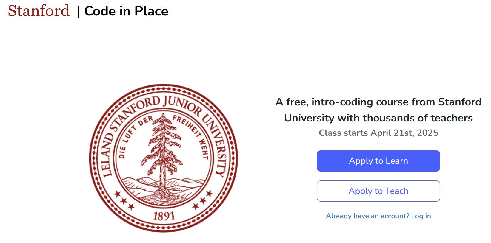

# Stanford CS106A - Code in Place 2025

    

## About Code in Place

Stanford University's "Code in Place" program is an international computer science Python course offered for free across the world.  In the 2025 version of the course, the program had 1,400 volunteer instructors and 21,000 students from over 150 countries.

Code in Place is the online version of Stanford's CS106A course ("Programming Methodology"), the university's largest and most popular programming course with enrollment of 1,600+ on-campus students per year.

Course website: 
 
https://codeinplace.stanford.edu/

YouTube intro video: 
  
https://www.youtube.com/watch?v=wg3Dl4yQSMU

Forbes article:
 
https://www.forbes.com/sites/michaeltnietzel/2023/06/01/stanford-universitys-free-code-in-place-course-hits-the-mark/amp/

## Section Slides

I am a Head TA for Code in Place 2025, where I lead a group of 100+ Section Leaders, each of whom teaches a weekly live section of 15 students over Zoom.

The program lasts 6 weeks and covers many topics in computer science and Python.  In the live sections, Section Leaders go over new concepts and work through hands-on exercises.

I created the slides in this repository for use in the weekly sections.

## Schedule

- Week 1 - Karel, Control Flow
- Week 2 - Art of Problem Solving, Decomposition
- Week 3 - Introduction to Python, Expressions
- Week 4 - Python Control Flow
- Week 5 - Graphics, Functions
- Week 6 - Lists, Dictionaries
- Beyond - Final Project